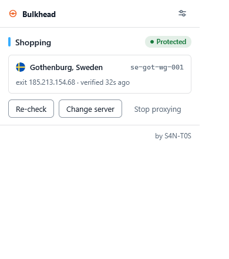
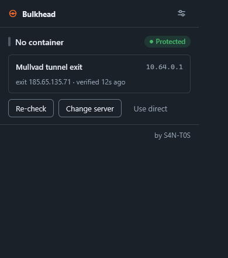
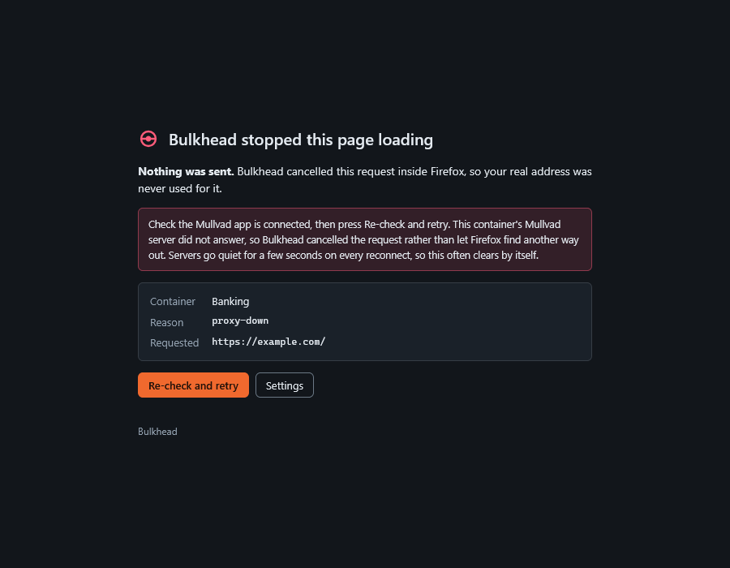

# Bulkhead

Fail-closed SOCKS5 proxies for Firefox containers. Each container — and the
default context and private windows, if you want — gets its own exit, and
**traffic is blocked whenever that exit is not confirmed working**, instead
of failing in whatever way the network happens to fail.

Like the watertight compartments it is named after: when one floods, its
doors seal shut and the ship stays afloat.

Works with Mullvad's SOCKS5 relays. Requires your own Mullvad account and an
active tunnel — the relays only exist inside it. Unofficial; not affiliated
with Mullvad AB.



## Why this exists

`proxy.onRequest` can only answer *which proxy*, never *no*. An extension
that assigns a proxy has no say in what happens when that proxy stops
answering — and for Mullvad it stops answering constantly, not occasionally:
every reconnect, server switch or laptop wake makes the in-tunnel relays
briefly unreachable. Bulkhead adds a second listener,
`webRequest.onBeforeRequest`, which *can* cancel, so while a container's exit
is not confirmed up its requests are killed outright and it says so.

The three failures that actually matter, none of which the proxy API can
address on its own:

- **The exit is silently the wrong one.** A proxy that answers is not a proxy
  that answers from where you configured. Bulkhead verifies the exit
  hostname, not just liveness, and blocks the container when they disagree.
- **Failure looks like an ordinary broken page.** Without a gate you get a
  network error and no idea whether anything escaped. Bulkhead cancels
  deliberately and tells you which container, which exit and why.
- **A configured proxy that Firefox cannot use.** An unroutable
  `ProxyInfo` — a bad port, a config half-written — takes Gecko's
  invalid-proxy path, which *is* a direct connection. One shared validity
  check governs both listeners so that state can't arise.

### About the "silent fallback to DIRECT"

This project started from the widely repeated claim that a dead proxy makes
Firefox fall back to an unproxied connection
([bug 1528873](https://bugzilla.mozilla.org/show_bug.cgi?id=1528873), closed
WONTFIX). Having read the source rather than the bug thread, that is not what
current Firefox does for extension-supplied proxies, and the honest version
is worth writing down.

`network.proxy.failover_direct` is read in exactly one place,
`nsHttpChannel::ProxyFailover()`, and the DIRECT fallback behind it is gated
three deep: the `MOZ_PROXY_DIRECT_FAILOVER` build flag, the pref itself, and
`LoadBeConservative()`. That last one is the decisive gate — the build
option's own help text describes it as failover "for system requests", and
`beConservative` is set on Firefox's internal networking, not on page loads.
`GetFailoverForProxy` returns `pi->mNext`, the chain the extension itself
supplied; nothing appends DIRECT to it.

So for ordinary traffic in a container, a dead exit means the request fails.
Four measured configurations agree — black-holed and connection-refused
proxies, each with the pref both ways, zero escapes
(`test/e2e/transition.mjs`).

One related case is real: if you have a **system or PAC proxy** configured,
that proxy is the tail of the chain, so a failed container exit falls through
to it. Not direct, but not your container's exit either. The exit check
catches it as `misrouted`.

Setting `network.proxy.failover_direct = false` is still worth doing as
defence in depth — build flags and gating change between versions, and this
is one line in `about:config` — but Bulkhead does not depend on it, and
anything claiming that pref is what stands between you and a leak is
repeating the folklore rather than the code.

## What it does not protect against

Read this part.

- **The window before a failure is noticed.** The request that *discovers* an
  exit is dead was issued while everything still looked fine, and no
  extension can close that. What it costs you is measured above: on current
  Firefox that request fails rather than escaping. With a system or PAC proxy
  configured it goes to that proxy instead, and the exit check catches it on
  the next probe.
- **DoH.** `network.trr.mode = 5`, manual. With DoH on, every container
  resolves names through one provider over your main tunnel, re-correlating
  exactly what the containers separate. Bulkhead cannot set this — but it
  *can* see it: `dns.resolve()` reports whether an answer came from a trusted
  recursive resolver, so DoH being switched back on is detected within ten
  minutes and revokes the setup acknowledgement rather than leaving a stale
  tick. The reverse is not provable, so a quiet result is reported as "no DoH
  seen", never as verified off.
- **Requests before the background page is running.** Anything Firefox issues
  during early startup is seen by neither listener. `persistent: true` is the
  mitigation the platform offers and it is set.
- **The extension being disabled, crashed or uninstalled.** Nothing protects
  you then.

There is deliberately no “test for leak” button. Three automated detectors
were built and all three reported identically with `failover_direct` in both
positions — including one aimed at the connection-refused path the earlier
two missed. A check that can say “safe” while you leak is worse than no
check, so none of them shipped.

What *is* checked continuously is the exit itself: every managed container is
probed against `am.i.mullvad.net`, and traffic emerging at any server other
than the one configured blocks the container as `misrouted`.

## What you get

- A per-container popup: current exit, live health, the verified exit IP, and
  a quick server switcher with search, favourites and recents.
- A killswitch that fails closed — on startup, before settings load, on
  probe timeouts, on wrong-exit answers, and on anything it cannot attribute
  (strict mode).
- **Every context is assignable, not just containers.** Tabs outside any
  container, and private windows, can each be pinned to a specific relay or
  to the **Mullvad tunnel exit** (`10.64.0.1`, the in-tunnel SOCKS endpoint
  that follows whatever server the app is connected to and is unreachable the
  moment the app is off). Pinning the default context also covers the
  extension's own requests, so the daily server-list refresh rides the same
  rules as everything else instead of leaving bare. Leave either on Direct
  and it is simply unmanaged.

  Private windows need one extra step: Firefox does not let an extension see
  them until you allow it, in about:addons → Bulkhead → Details → Run in
  Private Windows. Until then Bulkhead cannot gate them at all, and the
  options page says so next to the row rather than pretending otherwise.
- Offline awareness: the relay list refreshes daily, servers out of service
  disappear from the picker, and if one of *your* assigned exits goes offline
  you get told, with a one-click move to the same city.
- A blocked page that names the container, the exit and the reason, instead
  of a blank network error.
- Continuous DoH detection, because a setting you were asked to change once
  is a setting you can change back.
- Opt-in browser hardening: WebRTC forced through the proxy, prefetch and
  prerendering off. Global settings, so they are never applied silently, and
  fully restored when you switch them off.
- Per-tab toolbar badge: nothing when the exit is verified, `?` while
  checking, `!` when blocked.





## How it works

```
proxy.onRequest        cookieStoreId -> SOCKS5 ProxyInfo, from an in-memory
                       map. Fires first. Assigns only; cannot block.

webRequest.onBefore    decide(state, request) -> allow | block.
                       Blocking listener; the sole authority.

webRequest.onError     hard proxy errors trip health instantly; a plain
                       timeout only schedules a probe, since a slow site is
                       indistinguishable from a dead proxy.

alarms                 probe non-up containers every 30s to recover; sweep
                       healthy ones every 10m to catch silent misroutes;
                       refresh the relay list daily.
```

Every allow/block rule lives in [`src/decide.js`](src/decide.js) as one pure
function — no I/O, no clock, no browser APIs — and nothing else may
re-implement a rule. That is what makes the security-critical part
exhaustively testable, and what keeps AMO review of an `<all_urls>` proxy
extension tractable.

Choices worth knowing about:

- **Health is never persisted.** A restarted browser starts every managed
  container at `unknown`, which blocks, until a probe proves otherwise.
- **Fail closed before hydration.** Between background load and the storage
  read every container would otherwise read as unmanaged and go direct — a
  window that lands exactly on session restore.
- **Probes verify the exit, not liveness.** `am.i.mullvad.net` reports which
  server answered; the wrong one blocks the container. Note it reports the
  SOCKS relay name (`se-got-wg-socks5-001`), not the WireGuard hostname.
- **Probes cannot be forged.** A probe bypasses the gate only if it carries a
  single-use random token the background is currently holding *and* targets
  the probe endpoint. A page pasting the marker into its URLs gets nothing:
  unrecognised tokens take the normal path through both listeners.
- **The proxy host is the literal `10.124.x.x`**, resolved once at assignment
  time and refused if the answer is not a tunnel address. Resolving the
  hostname per request would tell your resolver which exit each container
  uses.
- **`connectionIsolationKey` per container**, so a connection opened for one
  container is never reused by another.
- **Strict mode governs only unattributable requests.** The killswitch
  applies regardless, so relaxing strict can never re-open a down container.
- **Zero runtime dependencies, no build step.** What you read in `src/` is
  what runs.

## Install

Not on AMO yet. Until then: `npm run build` produces the zip under `dist/`,
or load `src/` as a temporary add-on via `about:debugging` → This Firefox →
Load Temporary Add-on.

## Development

Node ≥ 22.13 and npm. On Windows you also need 7-Zip on PATH
(`scoop install 7zip`): the Firefox installer is a 7z archive and `setup`
unpacks it rather than running it, deliberately — a project about failing
closed should not execute a binary it just downloaded. The download is
checked against Mozilla's published SHA-256 before anything touches it.

```
npm install
npm run setup        # fetches Firefox Developer Edition into .cache/firefox/
npm start            # web-ext against that Firefox, fresh temp profile
```

`npm start` always uses a fresh temporary profile, on purpose: a profile
reused with `--keep-profile-changes` caches the extension's permission grant
set, and a permission added to the manifest later stays silently ungranted —
`browser.privacy === undefined` and an hour gone. The temp profile also gets
`failover_direct=false` and `trr.mode=5` so development happens in the safe
configuration.

| script | |
|---|---|
| `npm test` | unit tests (`node:test`, no framework) |
| `npm run test:coverage` | same, with coverage |
| `npm run test:e2e` | real Firefox, real relays — see below |
| `npm run lint` | eslint |
| `npm run lint:amo` | addons-linter, gated at 0 errors / 0 warnings / 0 notices |
| `npm run typecheck` | tsc over JSDoc annotations, no emit |
| `npm run build` | `dist/bulkhead-<version>.zip` |

## Testing

Unit tests cover the decision function exhaustively — including a sweep over
every combination of hydration × strict × health × attribution × request type
asserting that nothing defaults open — plus the relay-list adapters and
helpers.

`npm run test:e2e` copies `src/` to a build dir, appends a self-test to the
background, and drives the project-local Firefox with `web-ext` on a fresh
profile. Cases that need live relays detect the tunnel and skip without it
(CI runs the rest headless). Verified against Firefox 154 and live relays:

| case | result |
|---|---|
| dead proxy (`10.124.255.254`) | navigation aborted (`NS_ERROR_ABORT`) and never completed, reason `proxy-down`, explainer page rendered |
| server switched while a probe is in flight | the replacement is re-probed, never inherits the old verdict |
| live relay (`se-got-wg-001`) | health `up`, traffic passes |
| deliberately wrong exit configured | health `misrouted`, blocked |
| no containers managed | extension inert, nothing logged |
| default context on the tunnel exit, tunnel down | tabs blocked **and** the extension's own relay fetch blocked |
| default context on the tunnel exit, tunnel up | verified against `am.i.mullvad.net`, traffic passes |
| hardening apply / clear | takes control, then fully restores |

There is also a manual diagnostic for the transition window itself:
`node test/e2e/transition.mjs --failover-direct=true` pins the default
context to a live relay, streams exit checks, drops the tunnel mid-stream
through the `mullvad` CLI, and counts whether any request escapes to a
direct connection. Needs the CLI and a logged-in app; restores the tunnel
state it found.

**The manual test that matters**, once set up: assign two containers to
different exits and confirm on `https://am.i.mullvad.net/json` that they
differ. Drop the Mullvad tunnel and reload — you must get the blocked page,
not the site. Then set `network.proxy.failover_direct` back to `true` and
repeat to watch Firefox leak without the pref. That contrast is the whole
point. Finish with a glance at `about:networking#dns` for lookups that
shouldn't be there.

## Roadmap

Custom SOCKS5 endpoints per container, and support for other providers that
expose in-tunnel SOCKS the way Mullvad does. The plumbing is already
provider-shaped: an assignment is just an address, a port and an optional
expected exit name.

## Reporting a security issue

See [SECURITY.md](SECURITY.md). Anything that gets a managed context's
traffic onto the network without going through its assigned exit is the
report I most want to receive.

## Credits

By [S4N-T0S](https://s4nt0s.eu). Country flags are from
[circle-flags](https://github.com/HatScripts/circle-flags) (MIT), vendored in
`src/flags/`.

Not affiliated with, endorsed by, or supported by Mullvad AB. “Mullvad” is
used only to describe compatibility.

## License

GPL-3.0-only. See [LICENSE](LICENSE).
